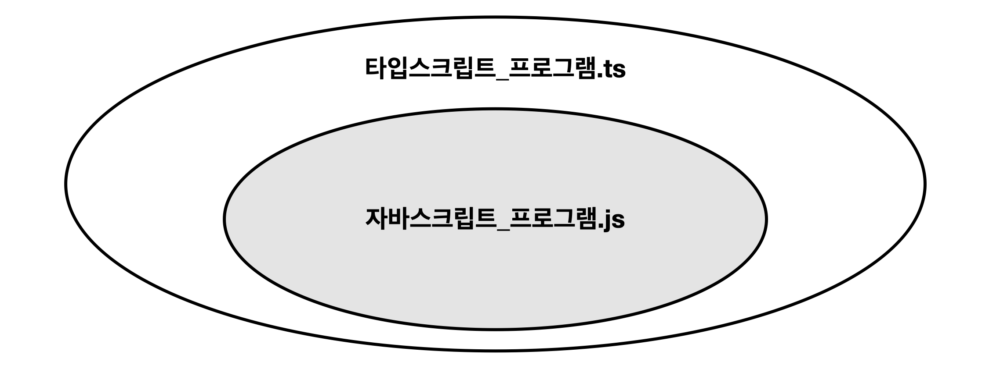
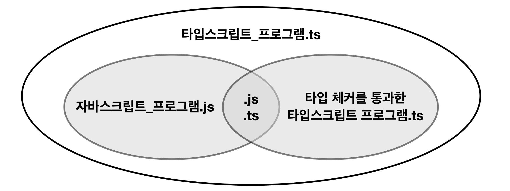
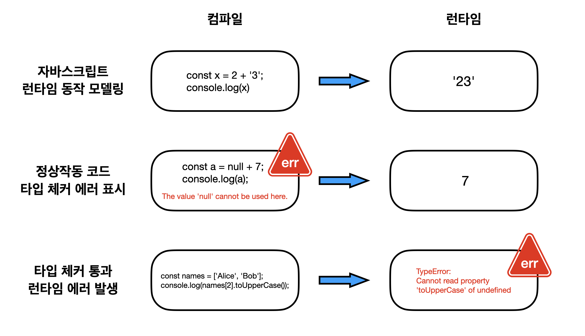

# 아이템1 타입스크립트와 자바스크립트의 관계 이해하기

## 1. 타입스크립트와 자바스크립트 

타입스크립트는 자바스크립트의 상위 언어입니다.



그런데 이것이 정말 맞는 표현일까요? 

타입스크립트는 자바스크립트의 상위 집합이기 때문에 .js 프로그램은 이미 .ts 프로그램이라 말할 수 있습니다.  
이에 따르면 .js 프로그램을 .ts로 변환했을 때 에러가 발생하지 않아야 합니다.

실제로 아래 프로그램을 .ts로 바꿔도 문제되지 않습니다.

1. 자바스크립트이자 타입스크립트 프로그램

```js
const str = "Hello World!";
console.log(str.toUpperCase());
```

그럼 아래 예제는 어떨까요?

1. 자바스크립트 프로그램

```js
const states = [
  {name: 'Alabama', capital: 'Montgomery'},
  {name: 'Alaska',  capital: 'Juneau'},
  {name: 'Arizona', capital: 'Phoenix'},
  // ...
];
for (const state of states) {
  console.log(state.capitol);
}
```

for문 안에서 capital을 capitol로 잘못 쓴 경우입니다. 이것의 확장자를 .ts로 바꾸는 순간 에러가 발생합니다. 

```ts
const states = [
  { name: "Alabama", capital: "Montgomery" },
  { name: "Alaska", capital: "Juneau" },
  { name: "Arizona", capital: "Phoenix" },
  // ...
];
for (const state of states) {
  console.log(state.capitol);
  // Property 'capitol' does not exist on type '{ name: string; capital: string; }'. Did you mean 'capital'?
}
```

이로써 타입스크립트는 자바스크립트의 상위 집합 언어기 때문에 .js를 .ts로 바꿔도 문제 없다는 말은 틀렸다고 할 수 있습니다. 전의 다이어그램을 보다 엄밀히 표현하면 다음과 같습니다. 



에러가 안난다를 기준으로 잡았을 때, .js와 .ts 확장자를 모두 가질 수 있는 코드(1)와 .js 확장자만 가질 수 있는 코드(2)가 존재합니다. 그러면 .ts 확장자만 가질 수 있는 코드는 무엇일까요?

3. 타입스크립트

```ts
interface State {
  name: string;
  capital: string;
}

const states: State[] = [
  {name: 'Alabama', capital: 'Montgomery'},
  {name: 'Alaska',  capital: 'Juneau'},
  {name: 'Arizona', capital: 'Phoenix'},
  // ...
];
```

이처럼 타입 구문을 사용한 것이 타입스크립트 프로그램이며 .js 파일로 변경하면 에러가 발생합니다.


## 2. 타입스크립트는 자바스크립트 런타임 동작을 모델링 한다?

타입스크립트는 기본적으로 자바스크립트 런타임의 동작을 모델링합니다. 즉, 런타임 오류를 발생시키는 코드를 찾아내려하거나 런타임에 이상이 없으면 코드를 정상으로 인식합니다. 

하지만, 예외는 있습니다. 아래 자바스크립트 프로그램은 런타임 에러를 발생시키지 않지만, 타입 체커는 문제점을 표시합니다. 이 외에도 자바스크립트 런타임 동작을 모델링하지 않는 경우가 있습니다.

```js
const a = null + 7;
const b = [] + 12;
alert('Hello', 'TypeScript');
```

타입 체커가 모든 에러를 검출할 수 있을 것으로 보입니다. 하지만, 타입 체커는 통과하지만 런타임 에러가 발생하는 경우도 있습니다.

```ts
const names = ['Alice', 'Bob'];
console.log(names[2].toUpperCase());

// Runtime
// TypeError: Cannot read property 'toUpperCase' of undefined
```


